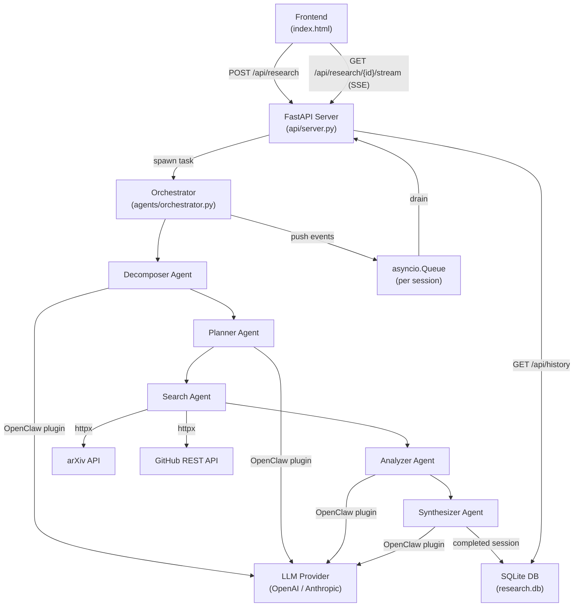
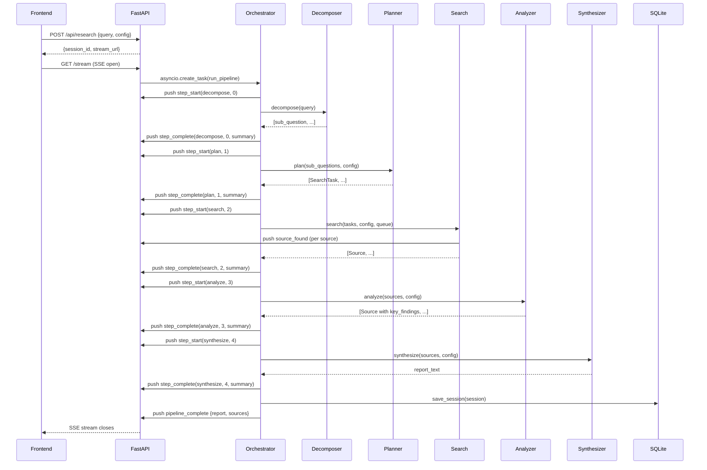

# Design Document: Multi-Agent Research Intelligence System

## Overview

The Multi-Agent Research Intelligence System is a Python backend that powers the existing `Frontend/index.html` React application. When a user submits a research query, the backend orchestrates a pipeline of five specialized AI agents using the OpenClaw framework to decompose the query, plan searches, retrieve sources from arXiv and GitHub, analyze and rank results, and synthesize a structured Markdown report.

The backend exposes a REST + Server-Sent Events (SSE) API. The frontend submits a query via `POST /api/research`, receives a `session_id` and `stream_url`, then opens an SSE connection to stream real-time pipeline progress events until the final report arrives.

The existing frontend currently uses simulated timeouts and hardcoded sample data. The integration work involves replacing `runSimulation()` with real API calls: a `fetch` to `POST /api/research` followed by an `EventSource` connection to the returned `stream_url`.

### Key Technology Choices

| Concern | Choice | Rationale |
|---|---|---|
| Web framework | FastAPI | Native async support, automatic OpenAPI docs, built-in SSE via `StreamingResponse`, Pydantic validation |
| Agent orchestration | OpenClaw | Multi-agent pipeline framework with plugin system for LLM provider injection |
| arXiv search | `arxiv` Python library | Official wrapper around the arXiv API; handles pagination and XML parsing |
| GitHub search | `httpx` + GitHub REST API v3 | Async HTTP client; GitHub library options are heavier than needed |
| Database | SQLite via SQLAlchemy (async) | Zero-config persistence; `aiosqlite` driver keeps the async event loop unblocked |
| LLM abstraction | OpenClaw plugin system | Allows swapping OpenAI ↔ Anthropic via environment variables without touching agent code |
| Streaming | `asyncio.Queue` + SSE | Each pipeline step pushes events to a per-session queue; the SSE endpoint drains it |
| Relevance scoring | Cosine similarity on LLM embeddings | Consistent scoring across arXiv and GitHub results against the original query |

---

## Architecture



### Request Lifecycle

1. `POST /api/research` — FastAPI validates the request body, creates a `ResearchSession` record (status `pending`), allocates an `asyncio.Queue` keyed by `session_id`, launches the orchestrator as a background `asyncio.Task`, and returns `{session_id, stream_url}`.
2. `GET /api/research/{session_id}/stream` — FastAPI opens an SSE `StreamingResponse` that drains the session queue, forwarding each event to the client. A 15-second keepalive coroutine runs concurrently.
3. The orchestrator runs the five-agent pipeline sequentially, pushing typed SSE event dicts to the queue after each step transition and source discovery.
4. On pipeline completion the orchestrator persists the full session to SQLite and pushes a `pipeline_complete` event. On timeout or error it pushes `pipeline_error` and cancels the task.

---

## Components and Interfaces

### `api/server.py` — FastAPI Application

Responsibilities:
- Mount all HTTP routes
- Validate request bodies with Pydantic models
- Manage the session queue registry (`dict[str, asyncio.Queue]`)
- Launch orchestrator background tasks
- Serve SSE streams
- Delegate history CRUD to the database layer

Key routes:

```
POST   /api/research
GET    /api/research/{session_id}/stream
GET    /api/health
GET    /api/history
GET    /api/history/{session_id}
DELETE /api/history/{session_id}
```

CORS is configured with `CORSMiddleware(allow_origins=["*"])`.

### `agents/orchestrator.py` — Orchestrator

Responsibilities:
- Accept a `ResearchSession` and an `asyncio.Queue`
- Run the pipeline: Decomposer → Planner → Search → Analyzer → Synthesizer
- Push `step_start` / `step_complete` SSE events around each agent call
- Enforce the 120-second session timeout via `asyncio.wait_for`
- Handle agent failures with retry logic (two attempts per agent)
- Push `pipeline_complete` or `pipeline_error` as the final event
- Persist the completed session via `db.save_session()`

### `agents/decomposer.py` — Decomposer Agent

Responsibilities:
- Accept the raw research query string
- Call the LLM (via OpenClaw) to generate 3–7 focused sub-questions
- Validate that each sub-question is ≤ 200 characters
- Retry once if fewer than 3 sub-questions are returned
- Return `list[str]`

### `agents/planner.py` — Planner Agent

Responsibilities:
- Accept `list[str]` sub-questions and a `Config`
- Call the LLM to generate one or more `SearchTask` objects per sub-question
- Deduplicate semantically equivalent tasks (LLM-assisted or embedding similarity)
- Cap total tasks at `config.maxSources * 2`
- Sort tasks by estimated relevance descending
- Return `list[SearchTask]`

### `agents/search.py` — Search Agent

Responsibilities:
- Accept `list[SearchTask]` and a `Config`
- For each `arxiv` task: query the `arxiv` library, extract fields, score relevance
- For each `github` task: query GitHub Search API via `httpx`, extract fields, score relevance
- Respect `config.sources.papers` and `config.sources.web` flags
- Handle API errors with retry/backoff per requirements
- Push `source_found` SSE events via the queue reference
- Return `list[Source]`

### `agents/analyzer.py` — Analyzer Agent

Responsibilities:
- Accept `list[Source]` and a `Config`
- Deduplicate by normalized title (lowercase, strip punctuation)
- Sort by relevance score descending
- Truncate to `config.maxSources`
- Call the LLM to generate a 2–4 sentence key-findings summary per source
- Return `list[Source]` (with `key_findings` populated)

### `agents/synthesizer.py` — Synthesizer Agent

Responsibilities:
- Accept `list[Source]` (with key findings) and a `Config`
- Call the LLM to generate a structured Markdown report
- Enforce word count bounds based on `config.depth`
- Apply format transformation for `Plain Text` and `Structured JSON` outputs
- Return `str | dict` (the report)

### `db/database.py` — Database Layer

Responsibilities:
- Initialize SQLite database and run migrations via SQLAlchemy
- Provide async CRUD operations: `save_session`, `get_session`, `list_sessions`, `delete_session`
- Map between SQLAlchemy ORM models and Pydantic domain models

### `models/` — Shared Data Models

Pydantic models used across the API, agents, and database layers (see Data Models section).

### `api/llm.py` — LLM Provider Factory

Responsibilities:
- Read `LLM_PROVIDER`, `LLM_MODEL`, `LLM_API_KEY` from environment
- Construct and return the appropriate OpenClaw LLM plugin instance
- Raise a startup error if `LLM_API_KEY` is absent

---

## Data Models

### `Config` (Pydantic)

```python
class DepthLevel(str, Enum):
    quick    = "Quick"
    standard = "Standard"
    deep     = "Deep"

class OutputFormat(str, Enum):
    markdown       = "Markdown"
    plain_text     = "Plain Text"
    structured_json = "Structured JSON"

class SourceTypes(BaseModel):
    papers:  bool = True
    web:     bool = True
    patents: bool = False
    news:    bool = False

class Config(BaseModel):
    depth:      DepthLevel   = DepthLevel.standard
    sources:    SourceTypes  = SourceTypes()
    maxSources: int          = Field(default=20, ge=5, le=50)
    format:     OutputFormat = OutputFormat.markdown
```

### `Source` (Pydantic)

```python
class SourceType(str, Enum):
    paper = "paper"
    repo  = "repo"

class Source(BaseModel):
    id:           str
    type:         SourceType
    title:        str
    authors:      str          # comma-separated
    venue:        str          # journal/conference name or "GitHub"
    year:         int
    url:          str
    abstract:     str          # full abstract or repo description
    relevance:    int          # 0–100
    key_findings: str | None = None  # populated by Analyzer
```

### `SearchTask` (Pydantic)

```python
class SearchTarget(str, Enum):
    arxiv  = "arxiv"
    github = "github"

class SearchTask(BaseModel):
    sub_question: str
    target:       SearchTarget
    query:        str
    priority:     int  # higher = more important
```

### `ResearchSession` (Pydantic + SQLAlchemy ORM)

```python
class SessionStatus(str, Enum):
    pending   = "pending"
    running   = "running"
    complete  = "complete"
    error     = "error"

class ResearchSession(BaseModel):
    session_id:   str
    query:        str
    config:       Config
    status:       SessionStatus
    sources:      list[Source]       = []
    report:       str | None         = None
    error_msg:    str | None         = None
    created_at:   datetime
    completed_at: datetime | None    = None
```

SQLAlchemy ORM table `research_sessions` stores `config`, `sources`, and `report` as JSON columns.

### API Request/Response Models

```python
# POST /api/research
class ResearchRequest(BaseModel):
    query:  str = Field(..., min_length=1, max_length=2000)
    config: Config = Config()

class ResearchResponse(BaseModel):
    session_id: str
    stream_url: str

# GET /api/history
class SessionSummary(BaseModel):
    session_id:   str
    query:        str
    completed_at: datetime

# GET /api/health
class HealthResponse(BaseModel):
    status:       str  # "ok"
    version:      str
    llm_provider: str
    llm_model:    str
```

### SSE Event Types

All SSE events are JSON-encoded in the `data` field. The `event` field identifies the type.

```
event: step_start
data: {"step_name": str, "step_index": int, "label": str}

event: step_complete
data: {"step_name": str, "step_index": int, "summary": str}

event: source_found
data: {"title": str, "authors": str, "venue": str, "year": int,
       "relevance": int, "type": "paper"|"repo", "url": str}

event: pipeline_complete
data: {"report": str, "sources": [Source, ...]}

event: pipeline_error
data: {"error": str}

: keepalive   (SSE comment, no data field)
```

---

## Agent Interaction Flow



### Pipeline Step Index Mapping

| Index | Step Name  | Agent       | Label (UI) |
|-------|------------|-------------|------------|
| 0     | decompose  | Decomposer  | Decomposing query into sub-questions |
| 1     | plan       | Planner     | Building research plan |
| 2     | search     | Search      | Searching academic databases & web |
| 3     | analyze    | Analyzer    | Analyzing and cross-referencing |
| 4     | synthesize | Synthesizer | Synthesizing research report |

> Note: The frontend's `AGENT_STEPS` array has 6 entries (indices 0–5) including a "browse" step at index 3. The backend pipeline consolidates browse into the analyze step. The frontend will be updated to use 5 steps matching the backend's pipeline.

---

## Frontend Integration

The frontend's `runSimulation()` function must be replaced with real API calls. The integration points are:

**Submit handler** — replace `runSimulation(query)` with:
```javascript
async function startResearch(query, config) {
  const res = await fetch('http://localhost:8000/api/research', {
    method: 'POST',
    headers: { 'Content-Type': 'application/json' },
    body: JSON.stringify({ query, config }),
  });
  const { session_id, stream_url } = await res.json();

  const es = new EventSource(stream_url);
  es.addEventListener('step_start',        handleStepStart);
  es.addEventListener('step_complete',     handleStepComplete);
  es.addEventListener('source_found',      handleSourceFound);
  es.addEventListener('pipeline_complete', handlePipelineComplete);
  es.addEventListener('pipeline_error',    handlePipelineError);
}
```

**History** — replace the hardcoded `history` state with calls to `GET /api/history` on mount and `DELETE /api/history/{id}` on delete.

**Config** — the existing `config` state shape matches the `Config` Pydantic model; pass it directly in the POST body.

---

## Project Structure

```
Backend/
├── main.py                  # uvicorn entry point
├── requirements.txt
├── .env.example
├── api/
│   ├── __init__.py
│   ├── server.py            # FastAPI app, routes, SSE streaming
│   ├── llm.py               # LLM provider factory
│   └── dependencies.py      # FastAPI dependency injection helpers
├── agents/
│   ├── __init__.py
│   ├── orchestrator.py
│   ├── decomposer.py
│   ├── planner.py
│   ├── search.py
│   ├── analyzer.py
│   └── synthesizer.py
├── db/
│   ├── __init__.py
│   ├── database.py          # SQLAlchemy engine, session factory
│   └── models.py            # ORM table definitions
└── models/
    ├── __init__.py
    ├── session.py           # ResearchSession, SessionStatus
    ├── source.py            # Source, SourceType
    ├── config.py            # Config, DepthLevel, OutputFormat
    ├── search.py            # SearchTask, SearchTarget
    └── events.py            # SSE event payload models
```

---

## Error Handling

| Scenario | Behavior |
|---|---|
| `LLM_API_KEY` not set at startup | Log warning; all `POST /api/research` requests return HTTP 503 |
| Invalid/empty query | FastAPI Pydantic validation returns HTTP 422 with field-level error detail |
| Query > 2000 chars | Pydantic `max_length` constraint returns HTTP 422 |
| Unknown `session_id` on stream | HTTP 404 |
| arXiv API error / timeout | Retry once; on second failure log and continue with partial results |
| GitHub 403 rate limit | Wait 60 s, retry once; on second failure log and continue |
| GitHub other error / timeout | Log and continue with partial results |
| Decomposer returns < 3 sub-questions (×2) | Fall back to original query as single sub-question; log warning |
| Synthesizer fails (×2) | Return partial report (Executive Summary + sources list) |
| Session exceeds 120 s | Cancel asyncio task; push `pipeline_error` with timeout message; log |
| SSE client disconnects | Detect via `asyncio.CancelledError` on queue drain; clean up queue entry |

All pipeline errors are surfaced to the frontend as `pipeline_error` SSE events before the stream closes, so the UI can display a meaningful error state rather than hanging.

---

## Correctness Properties

*A property is a characteristic or behavior that should hold true across all valid executions of a system — essentially, a formal statement about what the system should do. Properties serve as the bridge between human-readable specifications and machine-verifiable correctness guarantees.*

The feature involves business logic in pure functions (validation, ranking, deduplication, scoring, report structure) that are well-suited to property-based testing. The recommended PBT library is **Hypothesis** (Python).

### Property 1: Valid queries always produce unique session IDs

*For any* two valid research query strings (possibly identical), submitting each to `POST /api/research` SHALL produce two distinct `session_id` values.

**Validates: Requirements 1.2**

---

### Property 2: Invalid queries are always rejected

*For any* string that is empty, composed entirely of whitespace, or longer than 2000 characters, submitting it as the `query` field to `POST /api/research` SHALL return HTTP 422.

**Validates: Requirements 1.3, 1.4**

---

### Property 3: SSE source_found events are structurally valid

*For any* pipeline execution, every `source_found` SSE event emitted SHALL contain non-empty `title`, `authors`, `venue`, and `url` fields; a `year` that is a positive integer; a `relevance` score in the closed interval [0, 100]; and a `type` that is either `"paper"` or `"repo"`.

**Validates: Requirements 2.4, 5.3, 6.3**

---

### Property 4: SSE step events are structurally valid

*For any* pipeline execution, every `step_start` and `step_complete` SSE event SHALL contain a non-empty `step_name` string, a `step_index` in the range [0, 4], and a non-empty `label` or `summary` string respectively.

**Validates: Requirements 2.2, 2.3**

---

### Property 5: Decomposer sub-question count is bounded

*For any* non-empty research query string of at most 2000 characters, the Decomposer Agent SHALL return a list of between 3 and 7 sub-questions, each no longer than 200 characters.

**Validates: Requirements 3.1, 3.2**

---

### Property 6: Planner task count respects the config bound

*For any* list of sub-questions and any `Config`, the Planner Agent SHALL return a list of `SearchTask` objects whose total count does not exceed `config.maxSources * 2`.

**Validates: Requirements 4.2**

---

### Property 7: Planner tasks are ordered by priority descending

*For any* list of sub-questions and any `Config`, the `SearchTask` list returned by the Planner Agent SHALL be sorted such that `tasks[i].priority >= tasks[i+1].priority` for all valid indices `i`.

**Validates: Requirements 4.3**

---

### Property 8: Source relevance scores are always in range

*For any* arXiv or GitHub search result processed by the Search Agent, the assigned `relevance` score SHALL be an integer in the closed interval [0, 100].

**Validates: Requirements 5.3, 6.3**

---

### Property 9: Source deduplication removes all title duplicates

*For any* list of `Source` objects that contains two or more entries with the same normalized title (lowercase, punctuation stripped), the Analyzer Agent's deduplication step SHALL produce a list in which no two entries share the same normalized title.

**Validates: Requirements 7.1**

---

### Property 10: Analyzer output is sorted by relevance descending

*For any* list of `Source` objects passed to the Analyzer Agent, the returned list SHALL be sorted such that `sources[i].relevance >= sources[i+1].relevance` for all valid indices `i`.

**Validates: Requirements 7.2**

---

### Property 11: Analyzer output respects the maxSources bound

*For any* list of `Source` objects and any `Config`, the Analyzer Agent SHALL return at most `config.maxSources` sources.

**Validates: Requirements 7.3**

> *Reflection note: Properties 9, 10, and 11 each test a distinct invariant of the Analyzer (uniqueness, ordering, count bound). They cannot be collapsed because each tests a different structural guarantee of the output.*

---

### Property 12: Report contains all required sections in order

*For any* non-empty list of analyzed `Source` objects, the Markdown report produced by the Synthesizer Agent SHALL contain the headings "Executive Summary", "Key Findings", "Research Gaps", and "Conclusion" appearing in that order.

**Validates: Requirements 8.2**

---

### Property 13: Report word count respects depth configuration

*For any* `Config` with `depth = Quick`, the synthesized report SHALL contain between 400 and 800 words. For `depth = Standard`, between 800 and 1500 words. For `depth = Deep`, between 1500 and 3000 words.

**Validates: Requirements 8.4, 9.2, 9.3, 9.4**

> *Reflection note: Properties 12 and 13 are not redundant — 12 tests structural section presence while 13 tests word count bounds. Both are necessary.*

---

### Property 14: Session persistence round-trip

*For any* completed `ResearchSession` saved to the database, retrieving it by `session_id` via `GET /api/history/{session_id}` SHALL return a record whose `query`, `config`, `sources`, and `report` fields are equal to the values that were saved.

**Validates: Requirements 10.1, 10.3**

---

### Property 15: History is ordered by completion time descending

*For any* set of completed `ResearchSession` records in the database, `GET /api/history` SHALL return them ordered such that `sessions[i].completed_at >= sessions[i+1].completed_at` for all valid indices `i`.

**Validates: Requirements 10.2**

---

### Property 16: Deleted sessions are not retrievable

*For any* `ResearchSession` that has been successfully deleted via `DELETE /api/history/{session_id}`, a subsequent `GET /api/history/{session_id}` SHALL return HTTP 404.

**Validates: Requirements 10.5**

---

## Testing Strategy

### Unit Tests (pytest)

Focus on specific examples, edge cases, and error conditions:

- API validation: empty query, query > 2000 chars, missing fields, invalid config values
- Decomposer fallback: mock LLM to return < 3 sub-questions twice, verify fallback to original query
- Search agent error handling: mock arXiv/GitHub to return errors, verify retry and graceful continuation
- Synthesizer fallback: mock LLM to fail twice, verify partial report is returned
- LLM_API_KEY missing: verify HTTP 503 on research requests
- Session not found: verify HTTP 404 on unknown session_id
- Format transformations: Plain Text strips Markdown, Structured JSON has required keys

### Property-Based Tests (Hypothesis)

Each property test runs a minimum of 100 iterations. Tests are tagged with the property they validate.

```python
# Tag format: Feature: multi-agent-research-system, Property N: <property_text>
@settings(max_examples=100)
@given(query=st.text(min_size=1, max_size=2000).filter(lambda s: s.strip()))
def test_valid_queries_produce_unique_session_ids(query):
    # Feature: multi-agent-research-system, Property 1: valid queries always produce unique session IDs
    ...
```

Properties covered by Hypothesis tests:
- Property 1: Unique session IDs
- Property 2: Invalid query rejection (empty, whitespace, > 2000 chars)
- Property 3: source_found event structure (with mocked Search Agent)
- Property 4: step event structure (with mocked pipeline)
- Property 5: Decomposer sub-question count and length bounds (with mocked LLM)
- Property 6: Planner task count bound (with mocked LLM)
- Property 7: Planner task ordering
- Property 8: Relevance score range (unit-testable scoring function)
- Property 9: Source deduplication completeness
- Property 10: Analyzer sort order
- Property 11: Analyzer maxSources bound
- Property 12: Report section presence and order (with mocked LLM)
- Property 13: Report word count by depth (with mocked LLM)
- Property 14: Session persistence round-trip
- Property 15: History ordering
- Property 16: Deleted session returns 404

### Integration Tests

Run against a live server with real LLM calls (gated by `INTEGRATION_TESTS=1`):

- Full pipeline end-to-end: submit query, stream events, verify pipeline_complete
- arXiv API connectivity: verify at least one result returned for a known query
- GitHub API connectivity: verify at least one result returned for a known query
- Session persistence: complete a pipeline, verify history endpoint returns it
- CORS headers: verify `Access-Control-Allow-Origin: *` on all responses

### Smoke Tests

Run at startup / in CI without LLM calls:

- `GET /api/health` returns `status: "ok"` with correct version and LLM config
- CORS middleware is active
- SQLite database initializes without errors
- All three depth levels are accepted by the config validator
- `LLM_PROVIDER=openai` and `LLM_PROVIDER=anthropic` both pass validation
